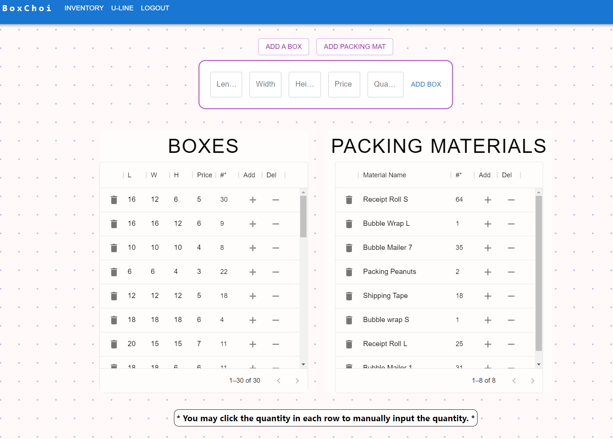
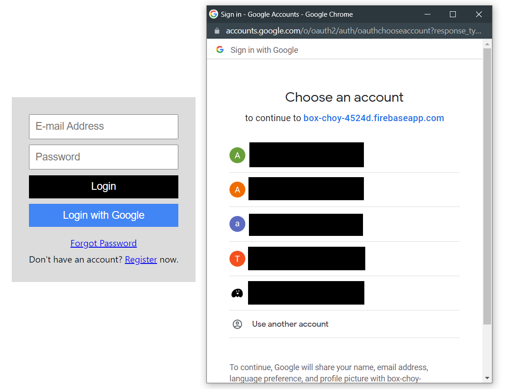

<div id="top"></div>

[![Contributors][contributors-shield]][contributors-url]

[![MIT License][license-shield]][license-url]

<div>
<h2 align="center">Box Choi</h2>
<p align="center">
    A customized inventory web application for our family business.
    <br />
    <a href="https://github.com/WhaleAnchor/Box-Choi"><strong> Go to the GitHub Repository »</strong></a>
    <br />
    <br />
    <a href="https://boxchoi.herokuapp.com/">Deployed on Heroku</a>
    ·
    <a href="https://github.com/WhaleAnchor/Box-Choi/issues">Report Bug</a>
    ·
    <a href="https://github.com/WhaleAnchor/Box-Choi/issues">Request Feature</a>
  </p>
</div>

## Table of Contents

<li><a href="#about-the-project">About the Project</a></li>
<li><a href="#built-with">Built With</a></li>
<li><a href="#installation">Installation</a></li>
<li><a href="#usage">Usage</a></li>
<li><a href="#license">License</a></li>
<li><a href="#contact">Contact</a></li>

## About The Project


This is a custom inventory management React single-page-application that is designed to solve the common problem of running out of items in my family store. With this app, our family store can say goodbye to the inconvenience and stress of running out of essential items. 
* The app utilizes Firebase to provide a cloud-based database, which can be accessed by all users of the app, providing real-time inventory updates.
* With user authentication options, including email/password or Google account, only authorized personnel can access the app. Employees can easily check the current stock of each item, and the app provides an intuitive interface for adding or removing items as needed.
* The cloud-based database ensures that all users have access to the most up-to-date inventory information, making it easier to manage the store and keep customers happy.
* The app is perfectly user-friendly on mobile for practical use.
* The deployed link on Heroku is a clone of the application we are using personally. There is no user restrictions on this deployed app so feel free to sign up with an email/password or through Google and try it for yourself!

 

 

 

Here is a link to the repo: <a href="https://github.com/WhaleAnchor/Box-Choy">BoxChoi</a>

<p align="right">(<a href="#top">back to top</a>)</p>

### Built With

[![React][react-shield]][react-url]

[![NodeJS][nodejs-shield]][nodejs-url]

[![Firebase][firebase-shield]][firebase-url]

[![Materialui][materialui-shield]][materialui-url]

<p align="right">(<a href="#top">back to top</a>)</p>

## Installation

1. Clone the repo.
    ```sh
    git clone git@github.com:WhaleAnchor/Box-Choi.git
    ```
2. Download the dependencies.
   ```sh
    npm i
   ```
3. Run the locally.
    ```sh
    npm run start
    ```
4. Make an account.
    ```sh
    Use email/password or Google account.
    ```

<p align="right">(<a href="#top">back to top</a>)</p>

## Usage

If you want to try using the website:

1. Head over to the deployed website on Heroku!
   ```sh
   https://boxchoi.herokuapp.com/
   ```

<p align="right">(<a href="#top">back to top</a>)</p>

## License

Distributed under the MIT License.

<p align="right">(<a href="#top">back to top</a>)</p>

## Contact

Andrew Choi - https://github.com/WhaleAnchor

Project Link: [https://github.com/WhaleAnchor/Box-Choi](https://github.com/WhaleAnchor/Box-Choi)

<p align="right">(<a href="#top">back to top</a>)</p>

<!-- Markdown links -->
[contributors-shield]:https://img.shields.io/github/contributors/WhaleAnchor/Tech-Blog.svg?style=for-the-badge
[contributors-url]:https://github.com/WhaleAnchor/Tech-Blog/graphs/contributors

[license-shield]:https://img.shields.io/github/license/othneildrew/Best-README-Template.svg?style=for-the-badge
[license-url]:https://github.com/othneildrew/Best-README-Template/blob/master/LICENSE.txt

[react-shield]:https://img.shields.io/badge/React-20232A?style=for-the-badge&logo=react&logoColor=61DAFB
[react-url]:https://react.dev/reference/react

[nodejs-shield]:https://img.shields.io/badge/Node.js-339933?style=for-the-badge&logo=nodedotjs&logoColor=white
[nodejs-url]: https://nodejs.org/en/

[firebase-shield]:https://img.shields.io/badge/firebase-ffca28?style=for-the-badge&logo=firebase&logoColor=black
[firebase-url]:https://firebase.google.com/docs

[materialui-shield]:https://img.shields.io/badge/Material%20UI-007FFF?style=for-the-badge&logo=mui&logoColor=white
[materialui-url]:https://mui.com/material-ui/getting-started/overview/


